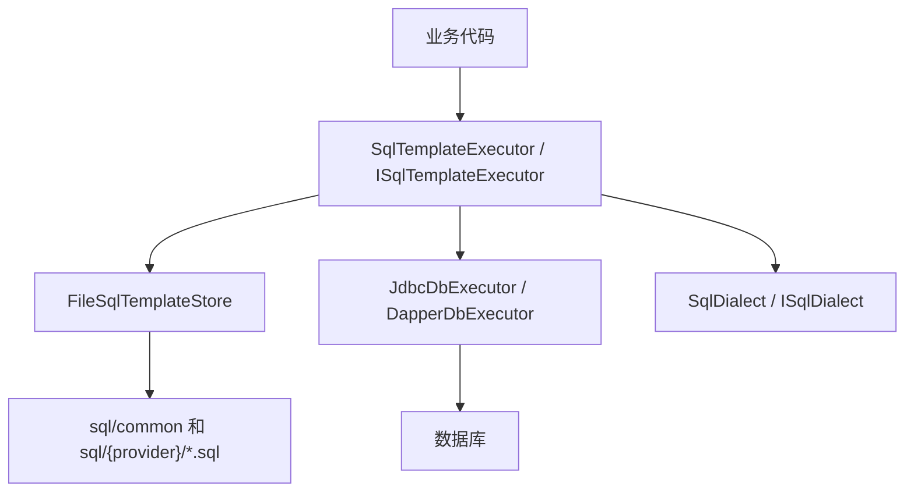

# database

`database` 是一个轻量级 SQL 模板数据库访问组件，当前提供 .NET、Java 和 Python 三套实现。

它的目标不是替代 ORM，而是将业务项目中的 SQL 代码不再写死在代码中，而是单独存储为 `.sql` 文件，方便维护；在修改数据库结构时不需要重新编译代码，提高维护的灵活性，同时复用统一的连接、参数绑定、分页、SQL 模板加载和多数据库适配能力。

## 核心特性

- 支持 .NET、Java 和 Python。
- 支持 SQL Server、MySQL、PostgreSQL、SQLite。
- SQL 使用外部 `.sql` 文件维护。
- SQL ID 等于文件名去掉 `.sql` 后缀。
- 支持 `common` 通用 SQL 和数据库专用 SQL 覆盖。
- 支持执行、查询单行、查询列表、分页查询。
- .NET 版基于 Dapper。
- Java 版基于 JDBC，不强依赖 Spring。
- Python 版基于标准库 sqlite3，默认零运行时外部依赖。

## 目录结构

```text
database/
  dotnet/     .NET 实现、测试和 Demo
  java/       Java JDBC 实现和测试
  python/     Python 实现和测试
  docs/       设计文档、接入文档和组件说明
```

## 总体架构



调用链大致是：

1. 业务代码传入 SQL ID，例如 `auth.user.getById`。
2. 模板执行器根据 SQL ID 从模板仓储读取 SQL。
3. 执行器把命名参数绑定到数据库命令。
4. 方言组件负责生成不同数据库的分页 SQL。
5. 查询结果映射为业务对象、基础类型或集合。

## SQL 模板规范

SQL 文件按数据库类型放置：

```text
sql/
  common/
    auth/
      auth.user.exists.sql
  mysql/
    auth/
      auth.user.getById.sql
  sqlserver/
    auth/
      auth.user.getById.sql
  postgresql/
    auth/
      auth.user.getById.sql
  sqlite/
    auth/
      auth.user.getById.sql
```

规则：

- SQL ID 等于文件名，不包含 `.sql`。
- `auth.user.getById.sql` 的 SQL ID 是 `auth.user.getById`。
- `common` 目录中的 SQL 是通用 SQL。
- 数据库专用目录中的同名 SQL 会覆盖 `common`。
- 一个目录范围内不要出现重复 SQL ID。
- 文件内容不能为空。
- 不再支持 `-- @id` 标记，避免 SQL ID 与文件名不一致。

常用 SQL 模板示例：

1. 按 ID 查询用户

文件路径：

```text
sql/common/auth/auth.user.getById.sql
```

```sql
select id, username, email
from users
where id = :userId
```

SQL ID：

```text
auth.user.getById
```

调用时传入同名参数：

```csharp
await sql.QuerySingleOrDefaultByIdAsync<User>(
    "auth.user.getById",
    new { userId = 1001 });
```

2. 判断用户是否存在

文件路径：

```text
sql/common/auth/auth.user.exists.sql
```

```sql
select count(1)
from users
where username = :username
```

3. 新增用户

文件路径：

```text
sql/common/auth/auth.user.create.sql
```

```sql
insert into users (username, email, created_at)
values (:username, :email, :createdAt)
```

4. 更新最后登录时间

文件路径：

```text
sql/common/auth/auth.user.updateLastLogin.sql
```

```sql
update users
set last_login_at = :lastLoginAt
where id = :userId
```

5. 分页查询

文件路径：

```text
sql/common/auth/auth.user.search.sql
```

```sql
select id, username, email, created_at
from users
where (:keyword is null or username like :keyword or email like :keyword)
  and (:status is null or status = :status)
order by created_at desc, id desc
```

调用分页接口时，组件会基于该 SQL 生成 count SQL 和数据库对应的分页 SQL。SQL Server 分页尤其需要稳定的 `order by`。

6. 数据库专用 SQL 覆盖

如果通用 SQL 无法兼容某个数据库，可以在 provider 目录下放同名文件覆盖 `common`。

通用文件：

```text
sql/common/auth/auth.user.latest.sql
```

```sql
select id, username, email, created_at
from users
order by created_at desc
```

MySQL 专用文件：

```text
sql/mysql/auth/auth.user.latest.sql
```

```sql
select id, username, email, created_at
from users
order by created_at desc
limit :take
```

当 Provider 是 MySQL 时，`auth.user.latest` 会使用 `sql/mysql/auth/auth.user.latest.sql`；其他数据库没有同名覆盖时继续使用 `common`。

Java 版和 Python 版使用 `:userId` 形式的命名参数。  
.NET 版使用 Dapper，SQL Server / MySQL / PostgreSQL / SQLite 均可按组件约定传入参数对象。

## .NET 版

### 项目说明

```text
dotnet/src/Tyouqu.Database.Abstractions
dotnet/src/Tyouqu.Database.Dapper
dotnet/src/Tyouqu.Database.SqlServer
dotnet/src/Tyouqu.Database.MySql
dotnet/src/Tyouqu.Database.PostgreSql
dotnet/src/Tyouqu.Database.Sqlite
dotnet/src/Tyouqu.Database
```

### NuGet 包坐标

打包后会生成：

```text
database
database.abstractions
database.dapper
database.sqlserver
database.mysql
database.postgresql
database.sqlite
```

### .NET 类职责

| 类 / 接口 | 所属项目 | 职责 |
| --- | --- | --- |
| `DatabaseOptions` | `database.abstractions` | 数据库配置，包括 Provider、连接字符串、超时时间、SQL 模板配置。 |
| `SqlTemplateOptions` | `database.abstractions` | SQL 模板根目录、重复 SQL ID 策略、缺失 SQL 策略。 |
| `DatabaseProvider` | `database.abstractions` | 数据库类型枚举：SQL Server、MySQL、PostgreSQL、SQLite。 |
| `IDbConnectionFactory` | `database.abstractions` | 创建数据库连接。不同数据库有不同实现。 |
| `IDbExecutor` | `database.abstractions` | 执行原始 SQL，提供执行、列表查询、单行查询、多结果集查询。 |
| `ISqlTemplateStore` | `database.abstractions` | 根据 SQL ID 获取 SQL 模板，支持重新加载。 |
| `ISqlTemplateExecutor` | `database.abstractions` | 根据 SQL ID 执行 SQL，是业务代码最常用的入口。 |
| `ISqlDialect` | `database.abstractions` | 数据库方言，负责标识符引用和分页 SQL 生成。 |
| `PageRequest` | `database.abstractions` | 分页请求，包含页码、页大小和 offset 计算。 |
| `PagedResult<T>` | `database.abstractions` | 分页返回结果，包含数据、总数、页码和页大小。 |
| `SqlMultipleResult` | `database.abstractions` | 多结果集查询返回模型。 |
| `TyouquDatabaseException` | `database.abstractions` | 组件统一异常，携带 SQL ID、Provider 等上下文。 |
| `FileSqlTemplateStore` | `database.dapper` | 从文件系统加载 SQL 模板，先加载 `common`，再加载数据库专用目录。 |
| `DapperDbExecutor` | `database.dapper` | 基于 Dapper 执行 SQL 并映射结果。 |
| `DapperSqlTemplateExecutor` | `database.dapper` | 根据 SQL ID 读取模板并调用 `IDbExecutor` 执行。 |
| `SqlServerConnectionFactory` | `database.sqlserver` | 创建 SQL Server 连接。 |
| `SqlServerDialect` | `database.sqlserver` | SQL Server 方言，使用 `offset ... fetch next ...` 分页。 |
| `MySqlConnectionFactory` | `database.mysql` | 创建 MySQL 连接。 |
| `MySqlDialect` | `database.mysql` | MySQL 方言，使用 `limit ... offset ...` 分页。 |
| `PostgreSqlConnectionFactory` | `database.postgresql` | 创建 PostgreSQL 连接。 |
| `PostgreSqlDialect` | `database.postgresql` | PostgreSQL 方言。 |
| `SqliteConnectionFactory` | `database.sqlite` | 创建 SQLite 连接。 |
| `SqliteDialect` | `database.sqlite` | SQLite 方言。 |
| `ServiceCollectionExtensions` | 各 provider 项目 | 注册 DI 服务。 |

### .NET 构建和测试

```powershell
cd dotnet
dotnet build .\database.sln
dotnet test .\database.sln --no-build
```

### .NET 打包

```powershell
cd dotnet
.\pack.ps1
```

输出目录：

```text
artifacts/packages
```

### .NET 使用示例

统一入口，根据配置选择数据库：

```csharp
using Tyouqu.Database.Abstractions;
using Tyouqu.Database.DependencyInjection;

builder.Services.AddTyouquDatabase(options =>
{
    options.Provider = DatabaseProvider.SqlServer;
    options.ConnectionString = configuration.GetConnectionString("Default")!;
    options.CommandTimeoutSeconds = 30;
    options.SqlTemplates.RootPath = "sql";
});
```

业务代码中使用：

```csharp
public sealed class UserRepository
{
    private readonly ISqlTemplateExecutor _sql;

    public UserRepository(ISqlTemplateExecutor sql)
    {
        _sql = sql;
    }

    public Task<User?> GetByIdAsync(long userId)
    {
        return _sql.QuerySingleOrDefaultByIdAsync<User>(
            "auth.user.getById",
            new { userId });
    }
}
```

如果只想引用某一个数据库 Provider，也可以使用单 Provider 入口，例如 SQL Server：

```csharp
using Tyouqu.Database.SqlServer.DependencyInjection;

builder.Services.AddTyouquSqlServerDatabase(options =>
{
    options.Provider = DatabaseProvider.SqlServer;
    options.ConnectionString = configuration.GetConnectionString("Default")!;
    options.SqlTemplates.RootPath = "sql";
});
```

## Java 版

### Maven 坐标

```xml
<dependency>
    <groupId>database</groupId>
    <artifactId>database</artifactId>
    <version>1.0.0</version>
</dependency>
```

### Java 类职责

| 类 / 接口 | 职责 |
| --- | --- |
| `DatabaseOptions` | 数据库组件配置，包含 Provider、超时时间和 SQL 模板配置。 |
| `SqlTemplateOptions` | SQL 模板配置，包含根目录和重复 SQL ID 策略。 |
| `DatabaseProvider` | 数据库类型枚举。 |
| `SqlTemplateStore` | SQL 模板仓储接口。 |
| `FileSqlTemplateStore` | 从文件系统加载 SQL 模板，支持 `common` 和 provider 覆盖。 |
| `DbExecutor` | 原始 SQL 执行接口。 |
| `JdbcDbExecutor` | 基于 JDBC 的 SQL 执行器，从 `DataSource` 获取连接。 |
| `SqlTemplateExecutor` | Java 版主要入口，根据 SQL ID 执行模板 SQL。 |
| `SqlDialect` | 数据库方言接口。 |
| `Dialects` | 根据 `DatabaseProvider` 创建对应方言。 |
| `NamedParameterSql` | 把 `:name` 命名参数转换成 JDBC `?` 参数。 |
| `RowMappers` | 把 `ResultSet` 映射成 `Map`、基础类型、JavaBean 或 record。 |
| `PageRequest` | 分页请求。 |
| `PagedResult<T>` | 分页结果。 |
| `TyouquDatabaseException` | 组件统一异常。 |

### Java 构建和测试

```powershell
cd java
mvn test
mvn package
```

安装到本地 Maven 仓库：

```powershell
cd java
mvn install
```

### Java JDBC 驱动

Java 版不内置数据库驱动，业务项目需要按实际数据库添加 JDBC 驱动。

MySQL：

```xml
<dependency>
    <groupId>com.mysql</groupId>
    <artifactId>mysql-connector-j</artifactId>
    <version>8.4.0</version>
</dependency>
```

SQL Server：

```xml
<dependency>
    <groupId>com.microsoft.sqlserver</groupId>
    <artifactId>mssql-jdbc</artifactId>
    <version>12.8.1.jre11</version>
</dependency>
```

PostgreSQL：

```xml
<dependency>
    <groupId>org.postgresql</groupId>
    <artifactId>postgresql</artifactId>
    <version>42.7.4</version>
</dependency>
```

SQLite：

```xml
<dependency>
    <groupId>org.xerial</groupId>
    <artifactId>sqlite-jdbc</artifactId>
    <version>3.46.1.0</version>
</dependency>
```

### Java 使用示例

```java
DatabaseOptions options = DatabaseOptions.builder()
    .provider(DatabaseProvider.MYSQL)
    .sqlTemplates(SqlTemplateOptions.builder()
        .rootPath("sql")
        .build())
    .build();

SqlTemplateStore store = new FileSqlTemplateStore(options);
DbExecutor db = new JdbcDbExecutor(dataSource);
SqlTemplateExecutor executor =
    new SqlTemplateExecutor(db, store, Dialects.forProvider(options.provider()));

User user = executor.querySingleOrDefaultById(
    "auth.user.getById",
    Map.of("userId", 1),
    User.class
);
```

Spring Boot 中可以复用 Spring 的 `DataSource`：

```java
@Configuration
public class DatabaseConfig {
    @Bean
    SqlTemplateExecutor sqlTemplateExecutor(DataSource dataSource) {
        DatabaseOptions options = DatabaseOptions.builder()
            .provider(DatabaseProvider.MYSQL)
            .sqlTemplates(SqlTemplateOptions.builder().rootPath("sql").build())
            .build();

        SqlTemplateStore store = new FileSqlTemplateStore(options);
        DbExecutor db = new JdbcDbExecutor(dataSource);
        return new SqlTemplateExecutor(db, store, Dialects.forProvider(options.provider()));
    }
}
```

## 高并发注意事项

### 必须使用连接池

Java 版 `JdbcDbExecutor` 每次执行都会从 `DataSource` 获取连接。生产环境应传入连接池，例如 HikariCP，而不是每次创建新连接。

```java
HikariDataSource dataSource = new HikariDataSource();
dataSource.setJdbcUrl("jdbc:mysql://localhost:3306/app");
dataSource.setUsername("root");
dataSource.setPassword("password");
dataSource.setMaximumPoolSize(30);
```

.NET 版底层驱动通常自带连接池，但仍要正确配置连接字符串和数据库最大连接数。

### 推荐单例使用

以下对象建议作为单例复用：

- `.NET`：`ISqlTemplateStore`、`ISqlTemplateExecutor`、`IDbExecutor`。
- `Java`：`FileSqlTemplateStore`、`JdbcDbExecutor`、`SqlTemplateExecutor`、`DataSource`。

不要在每个请求里重复加载 SQL 模板。

### SQL 模板加载

`FileSqlTemplateStore` 会把 SQL 模板加载到内存中，查询时按 SQL ID 从内存读取。修改 SQL 文件后，生产环境建议通过发布流程重启服务，或者显式调用 reload 能力。

### 执行日志与安全拦截

组件执行 SQL 时支持记录执行日志和慢 SQL 标记。日志内容包含数据库类型、执行类型、耗时、影响行数、返回行数、是否成功和异常信息；是否输出 SQL 文本、参数和是否只记录慢 SQL 由配置决定。

.NET 配置示例：

```csharp
builder.Services.AddTyouquDatabase(options =>
{
    options.SqlLogging.Enabled = true;
    options.SqlLogging.LogSql = true;
    options.SqlLogging.LogOnlySlowSql = false;
    options.SqlLogging.SlowSqlThresholdMs = 500;
});
```

Java 配置示例：

```java
DatabaseOptions options = DatabaseOptions.builder()
    .provider(DatabaseProvider.MYSQL)
    .enableSensitiveLogging(false)
    .sqlLogging(new SqlExecutionLogOptions(true, true, false, false, 500))
    .build();

JdbcDbExecutor db = new JdbcDbExecutor(
    dataSource,
    options,
    List.of(new FullTableOperationInterceptor(options.safety())),
    List.of(new ConsoleSqlExecutionLogger())
);
```

Python 配置示例：

```python
logs = []
options = DatabaseOptions(
    provider=DatabaseProvider.SQLITE,
    connection_factory=lambda: sqlite3.connect("app.db"),
    enable_sensitive_logging=False,
    sql_logging=SqlExecutionLogOptions(
        enabled=True,
        log_sql=True,
        log_parameters=False,
        slow_sql_threshold_ms=500,
    ),
)

db = SqliteDbExecutor(
    options.connection_factory,
    options,
    execution_loggers=[logs.append],
)
```

参数日志默认不输出。只有同时开启 `LogParameters` 和 `EnableSensitiveLogging` 时才会记录参数，生产环境建议谨慎开启。

内置安全拦截器会阻断没有 `where` 条件的全表 `update` 和 `delete`：

```sql
delete from users
update users set status = 0
```

如果业务确实需要执行这类维护 SQL，可以通过配置关闭对应阻断项，或者后续扩展白名单拦截器。

### 分页 SQL 要求

分页查询会基于原始 SQL 生成 count SQL 和分页 SQL。原始 SQL 建议：

- 不要带结尾分号。
- 复杂 SQL 建议自己提供专用分页 SQL。
- SQL Server 分页需要原 SQL 有稳定排序，否则分页结果可能不稳定。

### 参数命名

建议统一使用简单参数名：

```sql
where id = :userId
```

避免把参数名写成数据库关键字或包含特殊字符。

### 结果映射

Java 版当前支持：

- `Map`
- 基础类型
- JavaBean setter
- Java record

字段名匹配时会忽略大小写和下划线，例如 `user_id` 可以匹配 `userId`。复杂映射建议在 SQL 中使用别名。

## 适合和不适合的场景

适合：

- 团队希望 SQL 可直接审查和维护。
- 项目不想引入完整 ORM。
- 多个服务希望复用统一 SQL 模板规范。
- 同一套 SQL 规范需要同时支持 .NET 和 Java。

不适合：

- 需要实体变更自动迁移数据库。
- 需要复杂对象关系追踪。
- 希望完全由框架生成 SQL。
- 需要跨数据库完全透明的 SQL 兼容。不同数据库仍可能需要不同 SQL 模板。

## 开发路线

- 增加 Java SQL 解析缓存。
- 增加 Java 结果映射元数据缓存。
- 增加 Spring Boot Starter。
- 增加 GitHub Actions，自动执行 .NET 和 Java 测试。
- 增加更多真实数据库集成测试。
- 完善 NuGet 和 Maven Central 发布配置。

## 许可证

本项目使用 MIT License，详见 `LICENSE`。
